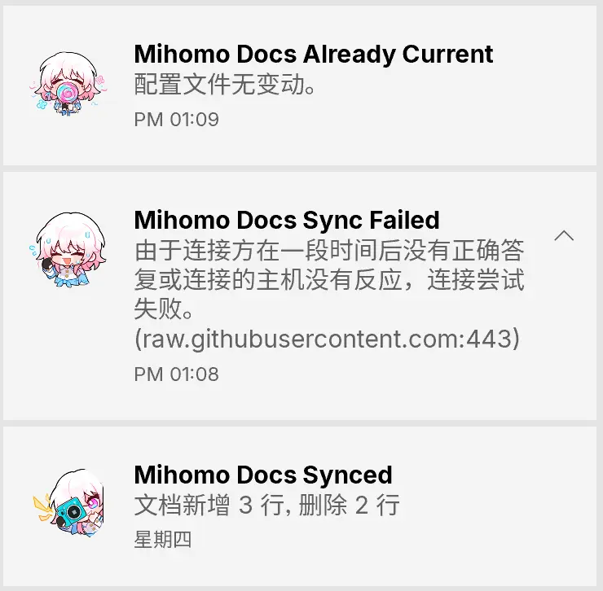
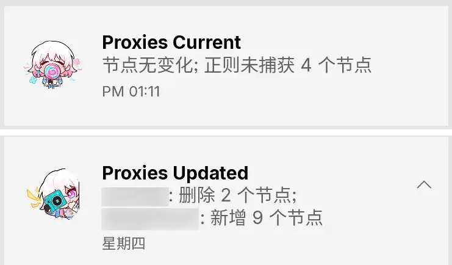

# Mihomo 裸核配置

> [!CAUTION]
> ⚠️ 警告：使用本项目即表示你同意[《免责声明》](DISCLAIMER.md)中的全部条款。请在继续前阅读。
>
> 1. 本项目**仅供具备网络技术基础的人员研究和学习使用**，普通用户请勿轻易尝试
> 2. 本项目按"现状"提供，不提供任何形式的担保、技术支持或使用指导
> 3. **作者不对因使用本项目而导致的任何直接或间接损失承担任何责任**，包括但不限于网络故障、数据丢失、设备损坏等
> 4. 本项目不接受任何形式的 Pull Request，不承诺处理任何 Issue，**作者保留随时删除仓库的权利且无需提前通知**
> 5. 本项目中的图标文件（`config/ui/icons`目录下所有PNG文件）来源于游戏《崩坏：星穹铁道》，版权归原权利人米哈游所有，严禁用于商业用途
> 6. **严禁将本项目用于任何色情、政治、宗教或违法犯罪目的，如有违反，使用者将承担全部法律责任，与仓库作者无关**
> 7. **任何因使用本项目而产生的法律纠纷、行政处罚或其他后果均由使用者自行承担全部责任，作者对此不承担任何连带责任**
> 8. **一旦使用本项目，即视为理解并同意上述所有声明，如有异议请立即停止使用并删除相关文件**

> [!CAUTION]
> ⚠️ WARNING: By using this project, you agree to the terms in [DISCLAIMER](DISCLAIMER.md). Read it before proceeding.
> 
> 1. This project is **strictly intended for research and educational purposes by individuals with a solid foundation in networking technologies**. General users are explicitly advised **not** to attempt deployment or usage.
> 2. This project is provided "AS IS," **without any form of warranty, technical support, or usage guidance**, either express or implied.
> 3. **The author shall not be held liable under any circumstances for any direct or indirect damages arising from the use of this project**, including but not limited to network outages, data loss, hardware damage, or system compromise.
> 4. This project **does not accept pull requests of any kind**, provides **no commitment to address or respond to issues**, and the author **reserves the right to delete this repository at any time without prior notice**.
> 5. All icon files (PNG files located in the `config/ui/icons` directory) are derived from the game *Honkai: Star Rail*, and are the exclusive property of miHoYo Co., Ltd. **Any commercial use of these assets is strictly prohibited**.
> 6. **Under no circumstances may this project be used for pornographic, political, religious, or any illegal or criminal activities**. Any violation shall result in the user bearing **full legal responsibility**, and the repository author shall bear **no association or liability whatsoever**.
> 7. **All legal disputes, administrative penalties, regulatory actions, or other consequences resulting from the use of this project shall be solely and entirely borne by the user**. The author assumes **zero joint, vicarious, or secondary liability** of any kind.
> 8. **By using this project, you explicitly acknowledge that you have read, understood, and unconditionally agreed to all terms of this disclaimer**. If you do not agree, you must **immediately cease all use and permanently delete all related files**.

***

<div align="center">

**本仓库提供了一套仅适用于 Windows10/11 平台的 Mihomo 裸核运行配置（未包含节点供应）**


</div>

## 前置下载
1. 浅克隆仓库到本地
  ```bash
  git clone --depth=1 https://github.com/ReRokutosei/MihomoCoreConfigExample.git
  ```
2. 下载 [Mihomo核心(amd64 v3版本)](https://github.com/MetaCubeX/mihomo/releases/latest) ，解压`mihomo-windows-amd64-v3.exe`至本地仓库根目录
   - 大多数人的电脑CPU架构都是amd64并支持v3指令集，如果不是，那请按照[mihomo官方说明](https://github.com/MetaCubeX/mihomo/wiki/FAQ)下载相应版本
3. 下载 [WinSW](https://github.com/winsw/winsw/releases) 放至 `script/winsw.exe`
  - NSSM 已于 2017 年停止更新，我不喜欢其古老的界面，所以不用；
  - WinSW 也于 2023 暂停更新(Author: `I have no time to maintain WinSW at the moment`)，但它符合我的需求，所以用。

## 配置

### step01 编辑 `config/main.yaml` 文件：

1. 替换订阅链接([点击查看参考](https://github.com/MetaCubeX/mihomo/discussions/2433#discussioncomment-15265377)):
  ```yaml
  proxy-providers:
    Airport1: # 名称可自定义
      url: '此处填入你的订阅链接（注意必须是非阅后即焚类型）'
      <<: *Remote
      path: './proxy_provider/airport1.yaml'

    # 读取本地配置
    # Airport2:
    # <<: *Local
    # path: './proxy_provider/airport2.yaml'
  ```

2. 根据需要修改其他配置项

<details>
<summary>关于GEO</summary>

~~实现上肯定是ruleset快点~~

~~那geo用数据库意义是？~~

~~没啥，单纯是v2系先弄出来的东西，早晚会砍掉的~~

~~(Σ(っ °Д °;)っ)~~

~~geo那块早就处于没人维护的 屎山代码阶段了~~

</details>

### step02 编辑 `script/winsw.xml` 文件

1. 将 `<executable>YOUR_MIHOMO_PATH\mihomo-windows-amd64-v3.exe</executable>`改为你存放mihomo核心的实际的绝对路径

2. 根据需要修改其他配置项

### step03 安装注册服务

以管理员权限启动powershell，使用`cd`命令进入当前仓库，再运行命令`./script/winsw.exe install`安装服务：

```powershell
cd C:\YourPath\
./script/winsw.exe install
```

### step04 启动核心服务

服务注册成功后，运行以下命令启动核心，之后核心服务会随开机而自启动

```powershell
./script/winsw.exe start
```

启动服务后，可通过以下地址访问 Zashboard 控制面板：

http://127.0.0.1:9090/ui/zashboard/

***

## 成型后的仓库结构

```
├── config/                               # 配置文件目录
│   ├── main.yaml                         # 主配置文件
│   ├── otherfiles/                       # 参考配置文件
│   ├── proxy_provider/                   # 代理提供商配置
│   ├── ui/                               # Web UI (Zashboard)
│   ├── config/ui/icons                   # 自定义图标(来自崩坏：星穹铁道)
│   └── rule_set/                         # 规则集文件
├── mihomo-windows-amd64-v3.exe           # Mihomo 核心可执行文件
├── script/                               # 脚本目录
│   ├── restart-mihomo.ps1                # 重启核心的快速脚本
│   ├── start-mihomo.ps1                  # 启动核心的快速脚本
│   ├── stop-mihomo.ps1                   # 停止核心的快速脚本
│   ├── sync-official-docs.ps1            # 同步官方示例配置文件
│   ├── sync-official-docs-run.vbs        # 辅助脚本
│   ├── sync-procider.ps1                 # 统计节点数量变动情况
│   ├── sync-procider-run.vbs             # 辅助脚本
│   ├── winsw.exe                         # Windows Service Wrapper
│   ├── winsw.xml                         # Windows Service Wrapper Config
│   └─logs/                               # 日志
└── docs/                                 # 各类文档
```

## 关于 `main.yaml`

<details>
<summary><strong>点击查看策略树示意</strong></summary>

- 简版示意树

  ```
  ROOT（规则入口）
  │
  ├─ AIGC / DOWNLOAD / STREAM / AdBlock / LeakBlock / HttpDNSBlock
  │        （第一层：按用途分流）
  │
  └─ PROXY（主出口）
    │
    ├─ 手动
    │   └─ 所有节点（排除“套餐 / 剩余”）
    │
    └─ 自动
        │
        ├─ 自动选择
        │   └─ 各国家地区节点
        ├─ 自动回退
        │   └─ 各国家地区节点
        └─ 负载均衡
            └─ 各国家地区节点
  ```

- 注意事项：`DOWNLOAD`(低倍率下载专用)和`STREAM`(流媒体解锁专用)这两个组，不会出现在webui面板中，它们将直接用于特定规则

- 详细版示意树

  ```
  ROOT（规则入口）
  │
  ├─ AIGC（第一层 · 业务专用）
  │  ├─ 自动
  │  │  └─ 自动选择
  │  │     ├─ 🇸🇬 新加坡 自动选择
  │  │     ├─ 🇯🇵 日本 自动选择
  │  │     ├─ 🇰🇷 韩国 自动选择
  │  │     ├─ 🇩🇪 德国 自动选择
  │  │     ├─ 🇬🇧 英国 自动选择
  │  │     └─ 🇺🇸 美国 自动选择
  │  └─ 手动
  │
  ├─ DOWNLOAD（第一层 · 下载专用）
  │  └─【倍率节点池】(0.1x / 0.01x)
  │
  ├─ STREAM（第一层 · 流媒体专用）
  │  └─【流媒体标记节点池】
  │
  ├─ AdBlock（第一层 · 广告拦截）
  │  ├─ REJECT
  │  ├─ REJECT-DROP
  │  └─ DIRECT
  │
  ├─ HttpDNSBlock（第一层 · DoH/DoT 泄漏）
  │  ├─ REJECT
  │  ├─ REJECT-DROP
  │  └─ DIRECT
  │
  ├─ LeakBlock（第一层 · STUN/WebRTC 泄漏）
  │  ├─ REJECT
  │  ├─ REJECT-DROP
  │  └─ DIRECT
  │
  └─ PROXY（第一层 · 主出口）
    │
    ├─ 手动（第二层）
    │  └─【排除带有“套餐/剩余”后的节点】
    │
    └─ 自动（第二层）
        │
        ├─ 自动选择（第三层）
        │  ├─ 🇭🇰 香港 自动选择
        │  ├─ 🇯🇵 日本 自动选择
        │  ├─ 🇰🇷 韩国 自动选择
        │  ├─ 🇸🇬 新加坡 自动选择
        │  ├─ 🇺🇸 美国 自动选择
        │  ├─ 🇬🇧 英国 自动选择
        │  ├─ 🇫🇷 法国 自动选择
        │  ├─ 🇩🇪 德国 自动选择
        │  ├─ 🇨🇭 瑞士 自动选择
        │  ├─ 🇦🇺 澳大利亚 自动选择
        │  ├─ 🇦🇪 阿联酋 自动选择
        │  ├─ 🇹🇷 土耳其 自动选择
        │  ├─ 🇮🇳 印度 自动选择
        │  ├─ 🇲🇾 马来西亚 自动选择
        │  ├─ 🇻🇳 越南 自动选择
        │  ├─ 🇹🇭 泰国 自动选择
        │  ├─ 🇰🇭 柬埔寨 自动选择
        │  ├─ 🇵🇭 菲律宾 自动选择
        │  ├─ 🇮🇩 印度尼西亚 自动选择
        │  ├─ 🇹🇼 台湾 自动选择
        │  ├─ 🇳🇱 荷兰 自动选择
        │  └─ 🇧🇷 巴西 自动选择
        │
        ├─ 自动回退（第三层）
        │  ├─ 🇭🇰 香港 自动回退
        │  ├─ 🇯🇵 日本 自动回退
        │  ├─ 🇰🇷 韩国 自动回退
        │  ├─ 🇸🇬 新加坡 自动回退
        │  ├─ 🇺🇸 美国 自动回退
        │  ├─ 🇬🇧 英国 自动回退
        │  ├─ 🇫🇷 法国 自动回退
        │  ├─ 🇩🇪 德国 自动回退
        │  ├─ 🇨🇭 瑞士 自动回退
        │  ├─ 🇦🇺 澳大利亚 自动回退
        │  ├─ 🇦🇪 阿联酋 自动回退
        │  ├─ 🇹🇷 土耳其 自动回退
        │  ├─ 🇮🇳 印度 自动回退
        │  ├─ 🇲🇾 马来西亚 自动回退
        │  ├─ 🇻🇳 越南 自动回退
        │  ├─ 🇹🇭 泰国 自动回退
        │  ├─ 🇰🇭 柬埔寨 自动回退
        │  ├─ 🇵🇭 菲律宾 自动回退
        │  ├─ 🇮🇩 印度尼西亚 自动回退
        │  ├─ 🇹🇼 台湾 自动回退
        │  ├─ 🇳🇱 荷兰 自动回退
        │  └─ 🇧🇷 巴西 自动回退
        │
        └─ 负载均衡（第三层）
          ├─ 🇭🇰 香港 负载均衡
          ├─ 🇯🇵 日本 负载均衡
          ├─ 🇰🇷 韩国 负载均衡
          ├─ 🇸🇬 新加坡 负载均衡
          ├─ 🇺🇸 美国 负载均衡
          ├─ 🇬🇧 英国 负载均衡
          ├─ 🇫🇷 法国 负载均衡
          ├─ 🇩🇪 德国 负载均衡
          ├─ 🇨🇭 瑞士 负载均衡
          ├─ 🇦🇺 澳大利亚 负载均衡
          ├─ 🇦🇪 阿联酋 负载均衡
          ├─ 🇹🇷 土耳其 负载均衡
          ├─ 🇮🇳 印度 负载均衡
          ├─ 🇲🇾 马来西亚 负载均衡
          ├─ 🇻🇳 越南 负载均衡
          ├─ 🇹🇭 泰国 负载均衡
          ├─ 🇰🇭 柬埔寨 负载均衡
          ├─ 🇵🇭 菲律宾 负载均衡
          ├─ 🇮🇩 印度尼西亚 负载均衡
          ├─ 🇹🇼 台湾 负载均衡
          ├─ 🇳🇱 荷兰 负载均衡
          └─ 🇧🇷 巴西 负载均衡
  ```

</details>


本仓库配置中的 filter 正则基于作者当前使用的机场供应商节点命名规则编写，不保证适用于所有机场或所有节点命名风格

因此请自行判断当前 Filter 是否适合自己的机场

要快速验证 Filter 是否生效，本仓库提供了辅助脚本`script\sync-provider.ps1`

该脚本会统计各 Filter 捕获的节点数量，详情请查看本文档脚本使用说明章节

***

## 更多说明

### 管理 WinSW 服务的命令

同理，先cd进入仓库内：

```powershell
# 启动服务
./script/winsw.exe start

# 停止服务
./script/winsw.exe stop

# 重启服务
./script/winsw.exe restart

# 卸载服务
./script/winsw.exe uninstall
```

> [!TIP]
> 
> 为日常方便快速执行，在完成安装注册服务后
>
> 你可以选中`start-mihomo.ps1`、`stop-mihomo.ps1`、`restart-mihomo.ps1`这三个脚本，点击鼠标右键以创建快捷方式
>
> 快捷方式随意更改图标，然后可放置桌面，也可放置开始菜单
>
> 开始菜单路径: `C:\Users\你的用户名\AppData\Roaming\Microsoft\Windows\Start Menu\Programs`
>
> 建议在开始菜单新建文件夹存放快捷方式，比如 `C:\Users\你的用户名\AppData\Roaming\Microsoft\Windows\Start Menu\Programs\Proxy`
>
> 另：Windows10 还可以将它们放置在磁贴(在开始菜单选中它们，点击右键-`固定到"开始"菜单`即可)


> [!IMPORTANT]
> 
> 注意：移动 `winsw.exe` 文件会导致服务无法正常工作
> 
> 因为 Windows 服务仍指向旧位置的可执行文件
> 
> 必须重新安装服务才能解决此问题。

### 脚本说明

<details>
<summary><strong>(可选配置)</strong></summary>

<details>
<summary><strong>sync-official-docs.ps1</strong></summary>

> 如果你不需要频繁查看官方文档，无需配置该脚本



脚本作用：自动同步 [mihomo 官方示例配置](https://raw.githubusercontent.com/MetaCubeX/mihomo/Alpha/docs/config.yaml) 到本地 `config/otherfiles/offical_example_config.yaml`，对比文档变动情况，记录日志并发送通知，最后自动提交 Git 变更(仅当文件内容变化时才提交)。

- ⚙️ 前置条件
  - 已安装PowerShell 7+，而不是用古老的pwsh5
  - 已安装pwsh模块：`Install-Module BurntToast -Scope CurrentUser`
  - Git 已配置 `user.name` / `user.email`

- ▶️ 运行
  ```powershell
  ./script/sync-official-docs.ps1
  ```

***

使用任务计划程序将脚本加入开机自启：

1. **修改 VBS 路径**  
   编辑填写 `sync-official-docs-run.vbs` 中 `psScript` 和 `pwsh` 的实际绝对路径。

2. **打开任务计划程序**  
   Win + R → 输入 `taskschd.msc` → 回车。

3. **创建任务（非“基本任务”）**，参考以下配置填写：

   - **常规**
     - 名称：`Sync Mihomo Official Config`
     - 描述：`同步 Mihomo 官方配置`
     - 用户：保持默认
     - 配置为：Windows 10 或对应系统版本

   - **触发器**
     - 新建 → “在用户登录时”
     - 延迟任务：`30 分钟`

   - **操作**
     - 新建 → “启动程序”
     - 程序：`wscript.exe`
     - 参数：`"你的实际路径\sync-official-docs-run.vbs"`（含英文双引号）

   - **条件**
     - 取消勾选“只有在计算机使用交流电源时才启动此任务”
     - 勾选“只有在网络连接可用时才启动”

   - **设置**
     - 如果任务失败，重新启动：`10 分钟`，最多 `3 次`

</details>

***

<details>
<summary><strong>sync-procider.ps1</strong></summary>



脚本作用：

自动扫描 `config/proxy_provider` 目录中的所有代理提供商配置文件

将其中的代理信息提取到 `config/otherfiles/proxies.yaml` 文件中(过滤含“剩余流量”、“套餐到期”关键词的无效节点)

对比新旧节点列表，记录新增/删除的节点

并检查所有节点是否被 `main.yaml` 中定义的 Filter 正则表达式覆盖

最后推通过BurntToast推送摘要信息

- ⚙️ 前置条件
  - 已安装PowerShell 7+，而不是用古老的pwsh5
  - 已安装pwsh模块：`Install-Module BurntToast -Scope CurrentUser`

- ▶️ 运行
  ```powershell
  .\script\sync-procider.ps1
  ```
- 📁 输入：`config/proxy_provider/*.yaml`
- 📁 输出：`config/otherfiles/proxies.yaml`

> 脚本依赖当前项目结构，勿移动 `script/` 或 `config/otherfiles/` 目录
>
> 脚本依赖读取main.yaml中的 `FilterXXX` 关键字以提取正则式
> 
> 如果新增表达式，请务必遵循 `FilterXXX` 格式

***

使用任务计划程序将脚本加入开机自启：

1. **修改 VBS 路径**  
   编辑填写 `sync-official-docs-run.vbs` 中 `psScript` 和 `pwsh` 的实际绝对路径。

2. **打开任务计划程序**  
   Win + R → 输入 `taskschd.msc` → 回车。

3. **创建任务（非“基本任务”）**，按以下配置填写：

   - **常规**
     - 名称：`Sync Procider`
     - 描述：`统计供应商节点变化情况`
     - 用户：保持默认
     - 配置为：Windows 10 或对应系统版本

   - **触发器**
     - 新建 → “在用户登录时”
     - 延迟任务：`10 分钟`

   - **操作**
     - 新建 → “启动程序”
     - 程序：`wscript.exe`
     - 参数：`"你的实际路径\sync-procider-run.vbs"`（含英文双引号）

   - **条件**
     - 取消勾选“只有在使用交流电源时才启动此任务”
     - 勾选“只有在网络连接可用时才启动”

   - **设置** 
     - 失败重启：每 `10 分钟` 一次，最多 `3 次`  


</details>
</details>


### 日志

服务运行日志保存在 `logs` 目录中，WinSW 会自动管理日志文件的轮转和清理。

## 其他
### 参考
1. [Aloxaf: Clash 中 GeoSite 分流的正确使用方式](https://www.aloxaf.com/2025/04/how_to_use_geosite/)
2. [yyhhyyyyyy: Mihomo 自用配置](https://iyyh.net/posts/mihomo-self-config)
3. [Sukka: 是什么，为什么，怎么做 —— 谈谈 DNS 泄漏、CDN 访问优化与 Fake IP](https://blog.skk.moe/post/lets-talk-about-dns-cdn-fake-ip/)
4. [fastoo: 分享一份自己维护的 国内主流企业工信部 ICP 备案域名列表](https://www.nodeseek.com/post-464238-1)

### 使用的规则集
1. [Sukka Ruleset](https://github.com/SukkaW/Surge)
2. [TG-Twilight: AWAvenue 秋风广告规则](https://github.com/TG-Twilight/AWAvenue-Ads-Rule)
3. [DustinWin: ruleset_geodata](http://github.com/DustinWin/ruleset_geodata)
4. [peiyingyao: Rule-for-OCD](https://github.com/peiyingyao/Rule-for-OCD)
5. [MetaCubeX: meta-rules-dat](https://github.com/MetaCubeX/meta-rules-dat/tree/meta)
6. [Loyalsoldier&Kwisma: clash-rules](https://github.com/Kwisma/clash-rules)
7. [fastoo: 国内主流企业工信部 ICP 备案域名列表](https://www.nodeseek.com/post-464238-1)