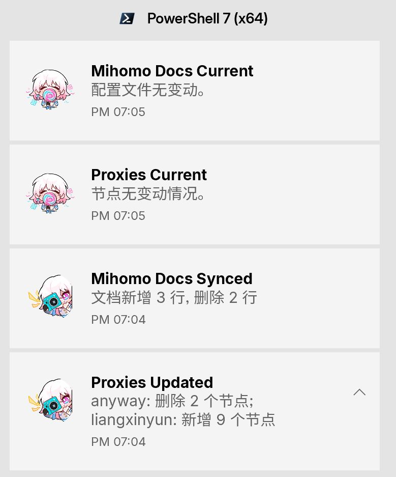

# Mihomo 裸核配置

> [!CAUTION]
> **声明**
> 
> 1. 本项目**仅供具备网络技术基础的人员研究和学习使用**，普通用户请勿轻易尝试
> 2. 本项目按"现状"提供，不提供任何形式的担保、技术支持或使用指导
> 3. **作者不对因使用本项目而导致的任何直接或间接损失承担任何责任**，包括但不限于网络故障、数据丢失、设备损坏等
> 4. 本项目不接受任何形式的 Pull Request，不承诺处理任何 Issue，**作者保留随时删除仓库的权利且无需提前通知**
> 5. 本项目中的图标文件（config/ui/icons目录下所有PNG文件）来源于游戏《崩坏：星穹铁道》，版权归原权利人米哈游所有，严禁用于商业用途
> 6. **严禁将本项目用于任何色情、政治、宗教或违法犯罪目的，如有违反，使用者将承担全部法律责任，与仓库作者无关**
> 7. **任何因使用本项目而产生的法律纠纷、行政处罚或其他后果均由使用者自行承担全部责任，作者对此不承担任何连带责任**
> 8. **一旦使用本项目，即视为理解并同意上述所有声明，如有异议请立即停止使用并删除相关文件**

<div align="center">

**本仓库提供了一套完整的 Mihomo 裸核运行配置（未包含节点供应）**

</div>

## 前置下载
1. 下载 [Mihomo核心(amd64 v3)](https://github.com/MetaCubeX/mihomo/releases/latest) 放至根目录
2. 下载 [WinSW](https://github.com/winsw/winsw/releases) 放至 `script\winsw.exe`
  - NSSM 已于2017年停止更新，我不喜欢其古老的界面；
  - WinSW 也于2023停止更新(Author: `I have no time to maintain WinSW at the moment`)，但它符合我的需求

## 目录结构

```
├── config/                               # 配置文件目录
│   ├── main.yaml                         # 主配置文件
│   ├── ASN.mmdb                          # ASN 数据库
│   ├── GeoSite.dat                       # GeoSite 数据库
│   ├── otherfiles/                       # 参考配置文件
│   ├── proxy_provider/                   # 代理提供商配置
│   ├── ui/                               # Web UI (Zashboard)
│   ├── config/ui/icons                   # 自定义图标(来自崩坏：星穹铁道)
│   └── rule_set/                         # 规则集文件
├── mihomo-windows-amd64-v3.exe           # Mihomo 核心可执行文件
├── script/                               # 脚本目录
│   ├── restart-mihomo.ps1                # 重启核心的快速脚本
│   ├── start-mihomo.ps1                  # 启动核心的快速脚本
│   ├── stop-mihomo.ps1                   # 停止核心的快速脚本
│   ├── sync-official-config.ps1          # 同步官方示例配置文件
│   ├── sync-official-config-run.vbs      # 辅助脚本
│   ├── sync-procider.ps1                 # 统计节点数量变动情况
│   ├── sync-procider-run.vbs             # 辅助脚本
│   ├── Sync Mihomo Official Config.xml   # 计时任务示例
│   ├── Sync Procider.xml                 # 计时任务示例
│   ├── winsw.exe                         # Windows Service Wrapper
│   ├── winsw.xml                         # Windows Service Wrapper Config
│   └─logs/                               # 日志
└── docs/                                 # 各类文档
```

## 路径配置说明

本仓库中的部分配置文件包含了示例路径标记 `<YOUR_MIHOMO_PATH>`，在实际使用前需要将其替换为您本地的实际路径。

需要修改的文件包括：
- winsw.xml
- Sync Mihomo Official Config.xml
- Sync Procider.xml
- sync-official-config-run.vbs
- sync-procider-run.vbs

请将 `<YOUR_MIHOMO_PATH>` 替换为你存放 mihomo 的实际目录路径。

## 配置说明

### 主要特性

1. **服务化运行**：使用 WinSW 将 Mihomo 注册为 Windows 服务，实现开机自启和后台运行
2. **Web UI 控制面板**：启用 Zashboard 控制面板，可通过浏览器管理
3. **TUN 模式**：启用 TUN 模式，网卡名称设置为 "Mihomo"
4. **自动更新**：支持订阅和规则集自动更新

### 配置文件

#### main.yaml

这是主配置文件，包含以下主要配置：

- 全局配置
- 外部控制器
- 订阅配置
- TUN 配置
- DNS 配置
- 规则集配置
- 代理分组配置
- 自定义规则

## 使用方法

### 修改配置

编辑 `config/main.yaml` 文件：

1. 替换订阅链接([点击查看参考](https://github.com/MetaCubeX/mihomo/discussions/2433#discussioncomment-15265377)):
  ```yaml
  proxy-providers:
    Airport1: # 名称可自定义
      url: '此处填入你的订阅链接（注意必须是非阅后即焚类型）'
      <<: *Remote
      path: './proxy_provider/airport1.yaml'

    # 读取本地配置
    # Airport2:
    # <<: *Local
    # path: './proxy_provider/airport2.yaml'
    
  ```

2. 根据需要修改其他配置项

## WinSW 服务方案
### 安装服务

以管理员权限启动pwsh，运行以下命令安装服务：

```powershell
./script/winsw.exe install
```

### 管理服务命令

```powershell
# 启动服务
./winsw.exe start

# 停止服务
./winsw.exe stop

# 重启服务
./winsw.exe restart

# 卸载服务
./winsw.exe uninstall
```

> 为方便快速执行任务，安装服务后
>
> 你可以选中`start-mihomo.ps1`、`stop-mihomo.ps1`、`restart-mihomo.ps1`这三个脚本，创建快捷方式
>
> 然后将快捷方式放到开始菜单`C:\Users\你的用户名\AppData\Roaming\Microsoft\Windows\Start Menu\Programs`
>
> Windows10 还可以将它们放置在磁贴


### 访问控制面板

启动服务后，可通过以下地址访问 Zashboard 控制面板：

http://127.0.0.1:9090/ui/zashboard/

## 移动文件注意事项

如果需要移动可执行文件或配置文件的位置，请注意需要重新安装服务以更新文件路径

> [!IMPORTANT]
> 
> 注意：移动 `winsw.exe` 文件会导致服务无法正常工作，因为 Windows 服务仍指向旧位置的可执行文件。必须重新安装服务才能解决此问题。

## 日志管理

服务运行日志保存在 `logs` 目录中，WinSW 会自动管理日志文件的轮转和清理。

## 其他

<details>
<summary><strong>脚本说明</strong></summary>



#### `sync-official-config.ps1` 使用说明

自动同步 [mihomo 官方示例配置](https://raw.githubusercontent.com/MetaCubeX/mihomo/Alpha/docs/config.yaml) 到本地 `config/otherfiles/offical_example_config.yaml`，并自动提交 Git 变更。

- ✅ 功能
  - 仅当文件内容变化时才提交
  - 生成日志：`script/logs/tracklog/sync-mihomo-config.log`
  - Windows 桌面通知（BurntToast）

- ⚙️ 前置条件
  - **PowerShell 7+**
  - 已安装模块：`Install-Module BurntToast -Scope CurrentUser`
  - Git 已配置 `user.name` / `user.email`

- ▶️ 运行
  ```powershell
  pwsh -ExecutionPolicy Bypass -File .\script\sync-official-config.ps1
  ```

- 🕒 自动化（任务计划程序）
  - 程序：`wscript.exe`
  - 参数：`"<YOUR_MIHOMO_PATH>\script\sync-official-config-run.vbs"`
  - 参考: `script\Sync Mihomo Official Config.xml`

#### `sync-procider.ps1` 使用说明

自动扫描 `config/proxy_provider` 目录中的所有代理提供商配置文件，并将其中的代理信息提取到 `config/otherfiles/proxies.yaml` 文件中，便于查看和跟踪代理节点的变化。

- ✅ 功能
  - 自动扫描目录中的所有 YAML 配置文件
  - 提取各配置文件中的代理节点信息
  - 生成统一的代理列表文件 `proxies.yaml`
  - 比较节点变化并生成日志
  - Windows 桌面通知（BurntToast）

- ⚙️ 前置条件
  - **PowerShell 7+**
  - 已安装模块：`Install-Module BurntToast -Scope CurrentUser`

- ▶️ 运行
  ```powershell
  pwsh -ExecutionPolicy Bypass -File .\script\sync-procider.ps1
  ```

- 🕒 自动化（任务计划程序）
  - 程序：`wscript.exe`
  - 参数：`"<YOUR_MIHOMO_PATH>\script\sync-procider-run.vbs"`
  - 参考：`script\Sync Procider.xml`

- 📁 相关目录
  - 输入目录：`config/proxy_provider/`（所有 `.yaml` 文件）
  - 输出文件：`config/otherfiles/proxies.yaml`
  - 日志文件：`script/logs/proxies-change.log`

> 脚本依赖当前项目结构，勿移动 `script/` 或 `config/otherfiles/` 目录。
</details>

## 参考
1. [Aloxaf: Clash 中 GeoSite 分流的正确使用方式](https://www.aloxaf.com/2025/04/how_to_use_geosite/)
2. [yyhhyyyyyy: Mihomo 自用配置](https://iyyh.net/posts/mihomo-self-config)
3. [Sukka: 是什么，为什么，怎么做 —— 谈谈 DNS 泄漏、CDN 访问优化与 Fake IP](https://blog.skk.moe/post/lets-talk-about-dns-cdn-fake-ip/)
4. [fastoo: 分享一份自己维护的 国内主流企业工信部 ICP 备案域名列表](https://www.nodeseek.com/post-464238-1)

## 使用的规则集
1. [Sukka Ruleset](https://github.com/SukkaW/Surge)
2. [TG-Twilight: AWAvenue 秋风广告规则](https://github.com/TG-Twilight/AWAvenue-Ads-Rule)
3. [DustinWin: ruleset_geodata](http://github.com/DustinWin/ruleset_geodata)
4. [peiyingyao: Rule-for-OCD](https://github.com/peiyingyao/Rule-for-OCD)
5. [MetaCubeX: meta-rules-dat](https://github.com/MetaCubeX/meta-rules-dat/tree/meta)
6. [Loyalsoldier&Kwisma: clash-rules](https://github.com/Kwisma/clash-rules)
7. [fastoo: 国内主流企业工信部 ICP 备案域名列表](https://www.nodeseek.com/post-464238-1)